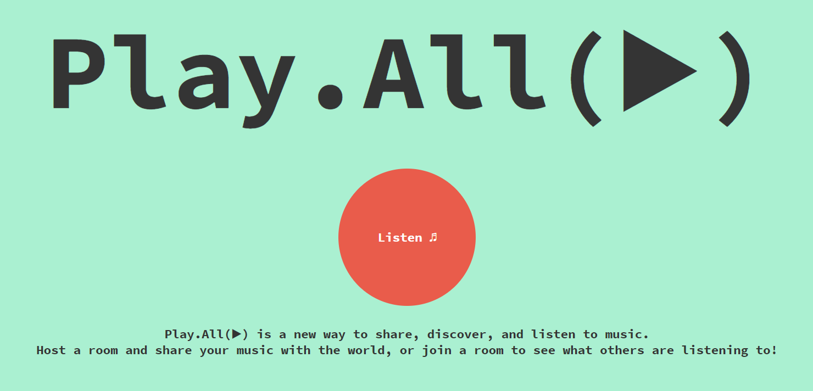
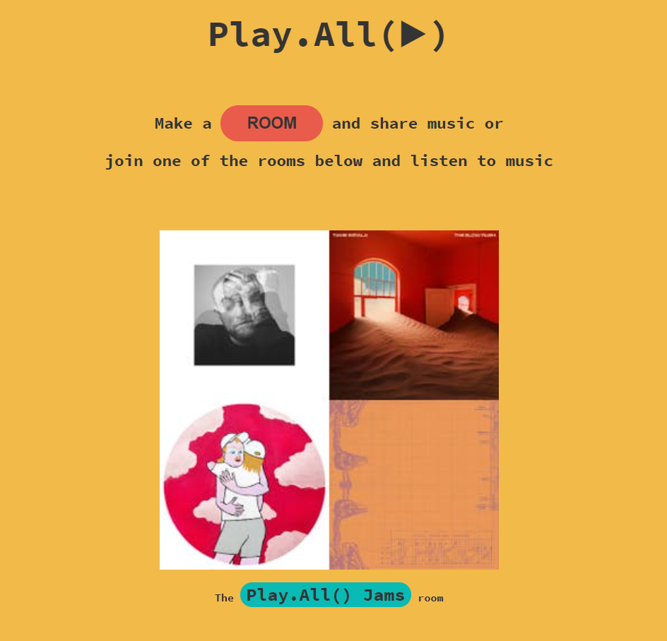

# Play.All(▶)

(This was created during our time as students at Code Chrysalis.)

Use this web app to enjoy all your Spotify music in a new way! Listen to the same song with friends at the same time, discover new music by joining another person's room, or relax and enjoy curated music in the permanent Play.All(▶) room.

Start enjoying your music together at:
[Play.All(▶)](https://playdotall.web.app/)

### Preview of the website:





## Installation

1. Feel free to clone the repo

2. Install packages

```bash
yarn install
```

3. Open in localhost

```bash
yarn start
```

## Built With

- [React](https://reactjs.org/docs/getting-started.html)
- [Spotify API](https://developer.spotify.com/documentation/web-api/)
- [Firebase Hosting and Firestore](https://firebase.google.com/)

## Contributing

Feel free to make some pull requests if you want to make some changes or add features.

## Future Plans

ANYTHING TO ADD??

## License

[MIT](https://choosealicense.com/licenses/mit/)

## Authors

- [Yurika Namba](https://github.com/yurikanamba)
- [Jeff Bentley](https://github.com/jbentleyjp)
